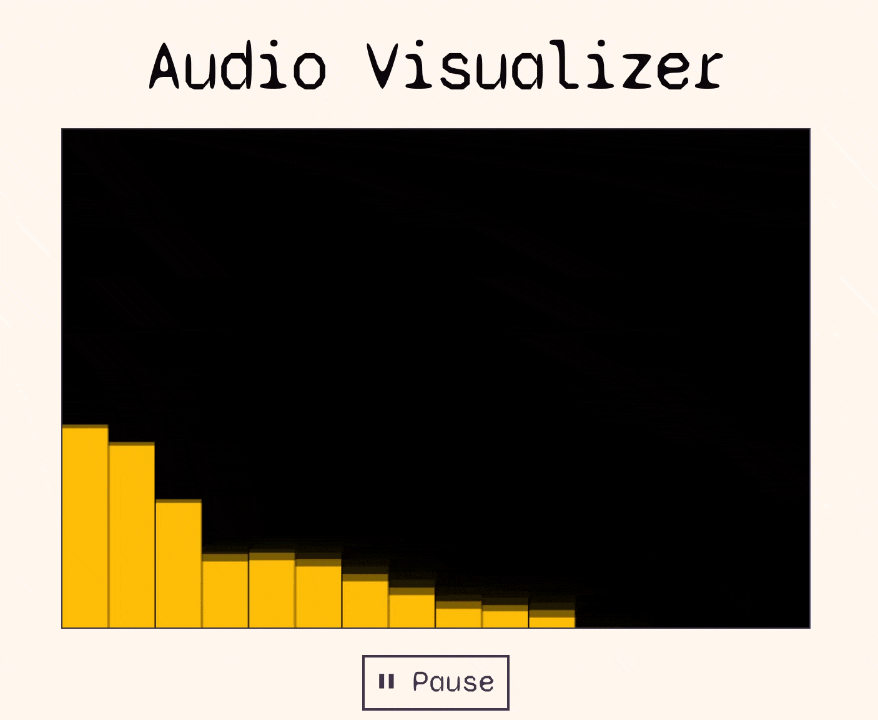

# Audio Visualizer



## About

A browser-based audio visualizer using microphone input to produce Winamp-like visualization. Supports light and dark mode.

## Tech

- React + TypeScript (Vite)
- Web Audio API

## Run locally

```console
git clone https://github.com/zofoklecja/audio-visualizer.git
cd audio-visualizer
npm install
npm run dev
```

## What I learned

Building this was a good opportunity to explore Web Audio and see how React handles side effects when working with imperative API. The interaction between state, refs and useEffect took some working out. I also migrated the project to TypeScript mid-development, which gave me hands-on experience typing canvas and Web Audio API interfaces.
